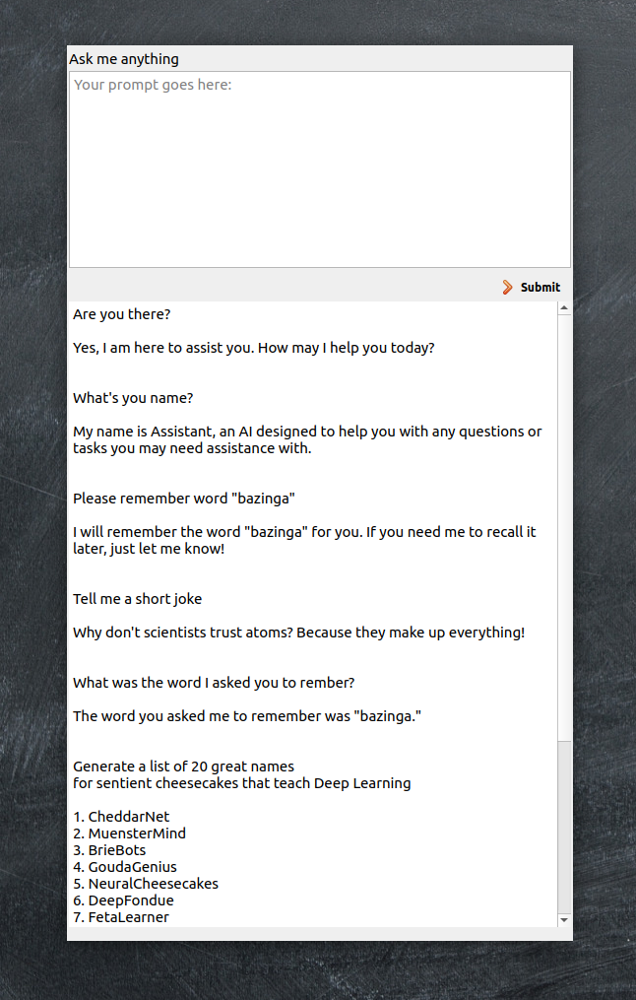

# pvf-openAI Assistent

This is a Python-Qt based application that uses the GPT-xxx model to create a helpful assistant that can answer any question you ask.

This is a simple demo of using openAI API to simulate chatGPT.

## Screenshot
All like screenshots, here one:



## ToDo
Everything

## Installation

Install the required packages via pip:

```
pip install PyQt5 openai
```

## UI Setup

The user interface is built using Qt Designer which creates an `assistent.ui` file. This file needs to be translated into Python code using the following command:

```
pyuic5 assistent.ui -o assistent.py
```

## Usage

1. Set your OpenAI API Key as an environment variable:

   ```
   export OPENAI_API_KEY=your_api_key_here
   ```

2. Run the Python script:

   ```
   python main.py
   ```

   Optionally, you can enable debug or info logs by passing "debug" or "info" as an argument:

   ```
   python main.py debug
   ```

   ```
   python main.py info
   ```

## Code Overview

The code consists of several classes:

- `openAIBackgroundTask`: A QThread subclass that handles incoming stream from GPT-4 model in the background.
- `MainWindow`: The main window class that handles the UI and user interactions.

The `MainWindow` class setups up the UI, connects buttons to their corresponding methods, and allows for window resizing and dragging. It also includes methods for handling text input and output and submitting user prompts to the GPT-4 model.

When the user submits a prompt, the `submit_action` method is called, which creates an `openai_arg` dictionary with the required parameters for the GPT-xxx model. The `openAIBackgroundTask` is then started in a separate thread, and its `progress` signal is connected to the `update_text_message` method, which updates the UI with the assistant's response.

The main part of the code sets up logging, retrieves the OpenAI API key from the environment variable, and initializes the QApplication and MainWindow.

GPT model can be changed in the code

```
MODEL = "gpt-3.5-turbo"
#MODEL = "gpt-4"
```


## License

No license, use it as you like.